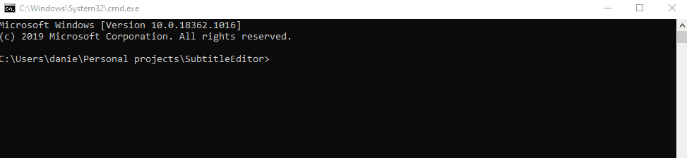

# SubtitleEditor

A simple tool to shift subtitles in srt file. 

Author - Daniel Rotem

Contents
--------

* [Description](#description)
* [Usage](#usage)
* [Support](#support)

Description
-----------

If your subtitles don't match the audio, you could easily fix that by shifting the time of appearance of each subtitle line. 
This is a simple tool to do this type of adjustment to subtitle files with the SRT extension. 
 
usage
-----
download this project to your local machine, and run the followind line in the command prompt - 

    SubtitleEditor>py subtitle_editor.py -file [-out_file] [-neg] [-h] [-min] [-sec] [-mil]
  
**The arguments are as follows:** 

 -file: absolute path to SRT file containing the subtitles you wish to shift.
 
 -out_file (optional): absolute path to a file to save the shifted subtitles into.

 -neg (optional): if specified, shift the subtitles backeards. otherwise they are shifted forward.

 -h (optional): number of hours you wish to shift subtitles.
 
 -min (optional): number of minutes you wish to shift subtitles.
 
 -sec (optional): number of seconds you wish to shift subtitles.
 
 -mil (optional): number of milliseconds you wish to shift subtitles.

support
-------
For any questions or comments, feel free to email me at danielrotem33@gmail.com

